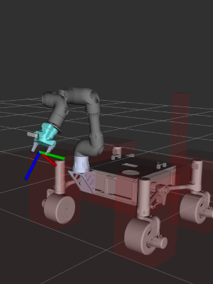
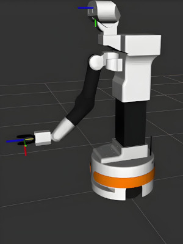

# Introduction

[[Ars Control Lab page]](https://www.arscontrol.unimore.it/)
[[Italo Almirante]](https://www.arscontrol.unimore.it/italo-almirante/)
[[Andrea Pupa]](https://www.arscontrol.unimore.it/andrea-pupa/)
[[Matteo Bicchi]](https://github.com/M4tt3)

This repository is a universal package to plan and execute trajectory or move commands for all manipulators. It handles universal robots manipulators by default, but its aim is to provide a way to easily implement custom robots.

It is conceived for beginners who wants to include robots in their projects, without a deep knowledge of manipulator kinematics and dynamics.




The package is made up of 2 main parts:
- **manipulator_planner**: This is the node which take care of planning, kinematics, collision avoidance...
- **manipulator_menu**: This is a class that acts as an API for the manipulator, it contains all the methods to interface with the robot and the scene. The command line interface and joystick controller provided in this package use the `ManipulatorMenu` class as their backbone.

More in depth informations can be found in the doxygen documentation by opening the symlink [docs.html](docs.html) through a browser.

# Installation

### 1. Pre-requisites
 - Ubuntu 22.04 (LTS)
 - Ros 2 Humble installed [(Guide)](https://docs.ros.org/en/humble/Installation.html)
 - Moveit2 installed [(Guide)](https://moveit.ai/install-moveit2/binary/)

### 2. Creating the workspace

    mkdir manipulators_ws
    cd manipulators_ws
    mkdir src
    colcon build

### 3. Downloading the packages

Inside the src folder of your workspace:

    git clone https://github.com/Italo-99/manipulators.git -b ros2-humble
    git clone https://github.com/Italo-99/motors_trajectory.git -b ros2-devel
    git clone https://github.com/Projectredunimore/manipulator_interfaces.git

Download the custom ur packages:

    git clone https://github.com/M4tt3/Universal_Robots_ROS2_Driver.git
    cd Universal_Robots_ROS2_Driver
    git submodule init && git submodule update

Clone the drivers for the robotiq85 gripper and move only the description package in the src directory:

    git clone https://github.com/PickNikRobotics/robotiq_85_gripper.git
    mv robotiq_85_gripper/robotiq_85_description <WORKSPACE_PATH>/src/robotiq_85_description

Install the realsense package:

    sudo apt install ros-humble-realsense2-*

Install additional dependencies:

    sudo apt install ros-humble-rviz-visual-tools
    sudo apt install ros-humble-xacro
    
## Install Coppelia

1. Download coppelia [here](https://www.coppeliarobotics.com/)
2. Download ros2 sim package for coppelia in a ros workspace of your choosing (just remember to always source it)

    ```
    git clone https://github.com/CoppeliaRobotics/simROS2.git
    ```
3. Set COPPELIASIM_ROOT_DIR env variable in your ~/.bashrc file by replacing <path_to_coppeliasim> with the path of the folder from step 1 and running this command:

    ```
    echo "export COPPELIASIM_ROOT_DIR=<path_to_coppeliasim>" >> ~/.bashrc
    ```
4. Add "sensor_msgs/msg/JointState" to 'simExtROS2/meta/interfaces.txt'

5. Install dependencies

    ```
    sudo apt install xsltproc
    pip install xmlschema
    ```

6. Build the workspace
7. Copy plugin file to coppelia directory

    ```
    cp build/sim_ros2_interface/libsimROS2.so $COPPELIASIM_ROOT_DIR
    ```

## Useful packages

1) [Install drivers for xbox one controller](https://fostips.com/install-driver-xbox-one-controller-headset-ubuntu/)
2) [ARS Control ur drivers](https://github.com/ARSControl/ur_rtde_controller/tree/humble)

# Use

### Planner Launch

To start the planner use the planner.launch.py launch file:

    ros2 launch manipulators planner.launch.py

To launch the planner with robotiq_85_gripper attached as end effector:

    ros2 launch manipulators planner.launch.py description_path:="<workspace_path>/install/manipulators/share/manipulators/models/urdf/ur_robotiq_85_gripper.urdf.xacro" description_semantic_path:="<workspace_path>/install/manipulators/share/manipulators/models/srdf/ur_robotiq_85_gripper.srdf.xacro" gripper:=True

### Planner parameters

This is a list of parameters that can be passed to the planner.launch.py launch file:

 - `rate`: Rate for the joint_state_publisher node (Hz).
 - `gui`: Whether to run joint_state_publisher with gui or not.
 - `publish_joint_states`: Whether to run joint_state_publisher node.
 - `rviz`: Whether to run rviz or not.
 - `ur_type`: Type of used UR robot (check list below).
 - `tf_prefix`: Prefix for each link and joint of the robot (not applied to joint states passed to manipulator_planner).
 - `rviz_config_path`: Absolute path to rviz config file.
 - `description_package`: Description package with robot URDF/XACRO files.
 - `description_path`: Absolute path to the URDF/XACRO description file of the robot.
 - `description_semantic_path`: Absolute path to the SRDF description file of the robot.
 - `moveit_config_package`: Name of the moveit config package for the robot.
 - `gripper`: Wether to enable gripper or not (supported gripper is robotiq_85_gripper).
 - `joint_limits_file`: Name of the joint limits file. IMPORTANT: This is NOT the joint_limits.yaml file in the moveit config package and should not be mistaken with it.
 - `kinematics_file`: Name of the kinematics file. IMPORTANT: This is NOT the kinematics.yaml file in the moveit_config package and should not be mistaken with it.

**NOTE**: Always use capital letters for `True` and `False` argument.

### The manipulator planner node

The manipulator planner node is used to elaborate trajectories, execute real time control and modify the planning scene. To run the node some parameters are required:

 - `manipulator_name`: A unique identifier for the manipulator.
 - `planning_group`: The planning group (specified in srdf).
 - `joint_names`: List of joint names of the planning group.
 - `ee_name`: Name of the end effector link.
 - `world_frame`: Cartesian point of reference.
 - `ros_freq`: Frequency at which the planner will operate.
 - `max_speed_ee`: Max speed the end effector can reach during jacobian control.
 - `max_accel_ee`: Max acceleration the end effector can reach during jacobian control.
 - `max_rot_speed_ee`: Max angular speed the end effector can reach during jacobian control.
 - `max_rot_accel_ee`: Max angular acceleration the end effector can reach during jacobian control.
 - `max_spd_jnts`: Max speed joints can move during real time joint control.
 - `max_acc_jnts`: Max acceleration joints can reach during real time joint control.
 - `gripper_links`: Links of the gripper to disable their collision with objects attached to the end effector.
 - `position_tolerance`: Tolerance for tcp position.
 - `orientation_tolerance`: Tolerance for tcp orientation.
 - `joint_tolerance`: Tolerance for joint positions.
 - `min_jacobian_determinant`: Minimum absolute value for the determinant of the jacobian matrix during jacobian control. A determinant close to 0 means the position is approaching a singularity point, this will ensure safer control of the arm.
<br/>

 - `robot_description` : Parsed urdf description of the robot.
 - `robot_description_semantic`: Parsed srdf description of the robot.
 - `robot_description_kinematics`: Path to the kinematics.yaml file (from robot moveit config package).
 - `robot_description_planning`: Path to joint_limits.yaml file (from robot moveit config package).
 - `ompl_planning_pipeline_config`: Path to the ompl_planning.yaml file (from robot moveit config package).

The launch file `planner.launch.py` will automatically retrieve all these parameters. The first group of parameters (until `gripper_links`) is only used by the manipulator planner node, they can be found inside the `config/` directory as .yaml file, one for each `ur_type`. The last five parameters are more like "global" parameters, in the sense they are used by many nodes other than the dynamic planner, they are retrieved by the `get_ur_moveit_config` function inside `manipulators/launch_utils.py` and passed to the appropriate nodes.

### The manipulator menu node

The manipulator menu node can be used to perform different actions with the manipulator, it has a simple command line interface.

To run the manipulator menu:

    ros2 run manipulators manipulator_menu_user

### Manipulator menu params

Can be edited in `src/manipulator_menu_node_user.cpp`:

 - `node_name`: Name for the manipulator menu node.
 - `ros_freq`: Frequency for the spinner.
 - `manipulator_name`: Name of the manipulator.
 - `planning_group`: Planning group specified in SRDF.
 - `gripper`: Wether to initialize clients for the robotiq_85_gripper.
 - `gripper_group`: Joint group name of the gripper.
 - `joint_names`: List of joint names in the planning_group.
 - `base_link_name`: Name of the base link to use as reference frame.

These parameters must match with the ones passed to manipulator_planner node.

### The joystick control node

The joystick control node can be used to control the manipulator movement in real time, in combination with the manipulator planner node it offers two modes:

1) **Real time joints control**: change the rotation of joints independently.
2) **Jacobian control**: control the speed of the end effector along each axis.

To run the joystick control node run the following two nodes:

    ros2 run joy game_controller_node

and

    ros2 launch manipulators joystick_controller.launch.py

### Joystick control parameters

Can be edited at `/config/joystick/generic.yaml`:

 - `manipulator_name`: Name of the manipulator.
 - `joint_names`: List of joints to be moved by the joystick.
 - `ros_freq`: Frequency for the spinner.
 - `gripper_group`: Joint group name of the gripper.
 - `vel_step`: How fast a movement in the joystick axis will make the end effector move during jacobian control.
 - `rot_step`: How fast a movement in the joystick axis will make the end effector rotate during jacobian control.
 - `js_step`: How fast a movement in the joystick axis will make the joints move during real time joints control.

### Real robot operation

To operate on a real robot first launch the appropriate driver.
In the case of [Ars control ur drivers](https://github.com/ARSControl/ur_rtde_controller/tree/humble) use:

    ros2 launch ur_rtde_controller rtde_controller.launch.py ROBOT_IP:=192.168.xx.xx enable_gripper:=true/false

Then you can launch the planner without joint state publisher as joint state feedback will be provided by real hardware:

    ros2 launch manipulators planner.launch.py publish_joint_states:=False ur_type:=<ur_type> gripper:=True/False

Finally launch the real_control_driver node:

    ros2 launch manipulators real_control_driver.launch.py ur_type:=<ur_type>

The real control driver parameters for each ur type can be found in `config/drivers/`, the parameters are:

 - `velocity_topic`: Where the velocities for joints will be published, depends on the driver used.
 - `joints_names_group`: List of joint names.
 - `kp`: Proportionality constant for acceleration.
 - `spinner_rate`: Frequency for control.
 - `min_motor_speed`: If required velocity is under this value motor will stop.

# Custom implementations

## Planner

To implement the planner on a custom robot you can create the **urdf** model and **srdf** models respectively in the models/urdf and models/srdf folders, then create the **yaml file** for the manipulator_planner parameters.

The convention is that all the files should have the same name except for the file extension which should be `.urdf.xacro`, `.srdf.xacro` and `.yaml`.

Also if you don't want to specify the `ur_type` launch argument the filename should be like this: `<ur_type>_custom_robot`.

Once all these files are created you should have a file structure such as this:

```
manipulator_planner/
├─ config/
│  ├─ ur5e_custom_robot.yaml
│  └─ ...
├─ models/
│  ├─ urdf/
│  │  ├─ ur5e_custom_robot.urdf.xacro
│  │  └─ ...
│  └─ srdf/
│     ├─ ur5e_custom_robot.srdf.xacro
│     └─ ...
...
```
## Menu

### Implementation with inheritance

This should be the preferable way of implementation for most of the applications, it involves inheriting from the `ManipulatorMenu` class to add your own methods and entries in the menu cli interface.

```c++
class MyManipulatorMenu : public ManipulatorMenu{
    public:
        MyManipulatorMenu(ManipulatorMenuParams params, const rclcpp::Node::SharedPtr& node, const bool sync_parameters=false)
        : ManipulatorMenu(params, node, sync_parameters) {
            //Your constructor...
        }

        ~SirioManipulatorMenu() = default;

        void mySpinnerMenu(){
            //Implementation of your custom menu interface
            customInitializeMenu();

            std::thread spinner_thread = std::thread([this] {
                spinner(); //Spinner from parent class
            });

            //BOILERPLATE SPINNER FOR THE MENU

            rclcpp::Rate r(params_.ros_freq);
            while (rclcpp::ok())
            {
                // Display the user menu and process user choices
                menu_->printMenu();
                int choice = menu_->getUserChoice();
                RCLCPP_INFO(node_->get_logger(), "User choice: %d", choice);
                menu_->processChoice(choice);

                r.sleep();
            }

            rclcpp::shutdown();
        }
                
        //Custom methods...

        void myUserAction(){
            //...
        }
    
    private:

        void customInitializeMenu(){
            menu_ = new MenuUserInterface<MyManipulatorMenu>(this);

            int section_start = 0; //Temporary variable to hold the last section start point

            menu_->addChoice("Plan and execute joint goal", &MyManipulatorMenu::userJointGoal);  //You can use methods from the parent class
            menu_->addChoice("Execute custom action", &MyManipulatorMenu::myUserAction);         //Or create custom user actions
            menu_->addSection("Section", section_start, menu_->last_);
            section_start = menu_->last_ + 1;

            //Add custom entries...
        }

        //Create an instance for the interface of your implementation
        MenuUserInterface<MyManipulatorMenu> *menu_; 
};

//Remember this line to build the template class of the interface
template class MenuUserInterface<MyManipulatorMenu>;
```

### Implementation as member variable <u>(DEPRECATED)</u>

Another way to create a custom implementation is the following, which involves creating a member class of type `ManipulatorMenu` inside a wrapper class.

```c++
class MyManipulatorMenu {
    public:
        MyManipulatorMenu(ManipulatorMenuParams params, rclcpp::Node::SharedPtr node) : params_(params), node_(node) {
            //Constructor
            //...
        }

        ~MyManipulatorMenu(){
            delete menu_interface_;
        }

        void spinner(){
            manipulator_menu_->spinner();
        }

        void spinnerMenu()
        {
            // Setup a rate for ROS loop execution
            rclcpp::Rate r(params_.ros_freq);
            initializeMenu();

            std::thread spinner_thread = std::thread([this] {
                spinner();
            });

            while (rclcpp::ok())
            {
                // Display the user menu and process user choices
                menu_interface_->printMenu();
                int choice = menu_interface_->getUserChoice();
                RCLCPP_INFO(node_->get_logger(), "User choice: %d", choice);
                menu_interface_->processChoice(choice);

                // Wait for next loop time
                r.sleep();
            }

            // Shutdown ROS if Ctrl+C or Ctrl+D are pressed
            rclcpp::shutdown();
        }

    private:
        void initializeMenu(){
            manipulator_menu_ = std::make_shared<ManipulatorMenu>(params_, node_);
            menu_interface_ = new MenuUserInterface<MyManipulatorMenu>(this);

            //Custom menu interface implementation
            //...
        }

        rclcpp::Node::SharedPtr node_;
        ManipulatorMenuParams params_;

        std::shared_ptr<ManipulatorMenu> manipulator_menu_;

        //Create an instance for the interface of your implementation
        MenuUserInterface<MyManipulatorMenu> *menu_interface_;
}

//Remember this line to build the template class of the interface
template class MenuUserInterface<MyManipulatorMenu>;

int main(int argc, char* argv[]) {
    ManipulatorMenuParams params;
    //Set custom parameters
    //...

    rclcpp::init(argc, argv);

    rclcpp::Node::SharedPtr node = std::make_shared<rclcpp::Node>(params.node_name);

    auto menu = std::make_shared<MyManipulatorMenu>(params, node);
    menu->spinnerMenu();

    rclcpp::shutdown();

    return 0;
}

```

## Joystick

The joystick node inherits from the `ManipulatorMenu` class, this makes it able to use its functions and to easily inherit any change made to the menu. Joystick commands are read using the `joy ` package, by default the `game_controller_node` is used, this node can be preferable over its counterpart `joy_node` as it provides joystick mappings for most consumer joysticks so no further logic is needed other than binding each command to its respective action. 

You can launch both the `game_controller_node` and the `joystick_controller_node` by using:

    ros2 launch manipulators joystick_controller.launch.py

### Custom mappings

It is possible some joysticks won't be correctly mapped by the `game_controller_node` or that you want to use different bindings, for this you can create a class that inherits from the `JoystickController` class and overrides the `joyCallback` method, this allows users to be able to code their own logic while still relying on the basic functions.

Here is a quick guide on how to setup your custom mappings:

#### 1. Create the mapping class

You can see some examples on how this is done in `include/manipulators/JoystickController.h` (bottom of the header) and `src/joystick_controller_mappings.cpp`, in this case an header file is used but you can implament is however you want, here is a more compact example:

```cpp
class MyCustomJoystickController : public JoystickController
{
    public:
        MyCustomJoystickController(ManipulatorMenuParams params, rclcpp::Node::SharedPtr node, const bool sync_parameters = false): 
            MyCustomJoystickController(params, node, sync_parameters) {
            //Constructor...
        }

    protected:
        void joyCallback(const sensor_msgs::msg::Joy::SharedPtr &joy) override{
            //Custom controller commands logic...
        };
};
```

#### 2. Add to the JoystickControllerFactory

Since the desired profile is passed to the launch file as a parameter a factory will take in the profile name and construct the appropriate node.
To add your custom mapping to the factory navigate to `src/joystick_controller_mappings.cpp`, at the start of the file you will find the `JoystickControllerFactory::fromProfile` method, inside this method add your mapping to the `profileFactories` variable by following this template:

```cpp
{"<profile_name>", [](ManipulatorMenuParams p, rclcpp::Node::SharedPtr n, bool s) {
    return std::make_shared<MyCustomJoystickController>(p, n, s);
}}

```

#### 3. (Optional) specify if your mapping should use game_controller_node

By default the launch file will use the `game_controller_node` only for the `default` profile (which loads the plain `JoystickController` class), if your custom implementation should use it navigate to `launch/joystick_controller.launch.py` and add the profile name to the `game_controller_profiles` list.

#### 4. Launch the controller

Use the following command to launch custom joystick control nodes:

    ros2 launch manipulators joystick_controller.launch.py profile:=<profile_name>
